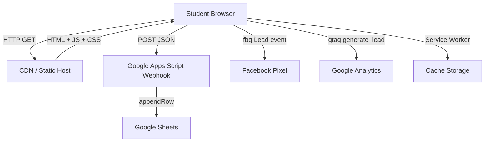

# Design Document: CareerSpark Mobile App

## Overview

CareerSpark is a single-page, mobile-first AstroJS web application that converts social media advertisement traffic into student leads. The application guides a student through a short questionnaire about their Plus Two results and academic stream, then instantly surfaces personalised course recommendations. All lead data is persisted to Google Sheets via a Google Apps Script webhook. The app supports UTM tracking, Facebook Pixel, Google Analytics, PWA installation, and is optimised for mobile conversion.

### Key Design Decisions

- **AstroJS with Islands Architecture**: The majority of the page is static HTML for fast initial load. Interactive regions (Toggle, forms, Success Screen) are hydrated as isolated client-side islands using Astro's `client:load` directive.
- **No backend server**: All dynamic behaviour runs client-side. Lead persistence is delegated to a Google Apps Script Web App endpoint, eliminating the need for a dedicated API server.
- **Client-side Recommendation Engine**: Course recommendations are a static lookup table bundled with the app. No network request is needed to compute recommendations, ensuring instant results.
- **@vite-pwa/astro for PWA**: The `@vite-pwa/astro` integration (built on Workbox) handles service worker generation and manifest injection with zero manual configuration.
- **GSAP for animations**: GSAP with ScrollTrigger handles course card entrance animations. `canvas-confetti` handles the success screen celebration. A custom lightweight canvas loop handles the particle background.

---

## Architecture

The application is a static site generated by AstroJS and deployed to a CDN (e.g., Netlify, Vercel, or Cloudflare Pages). There is no server-side rendering at runtime.



### Request Flow

1. Student clicks ad → lands on CareerSpark with UTM parameters in URL.
2. AstroJS static HTML is served from CDN (fast TTFB).
3. Client-side JS hydrates interactive islands (Toggle, Form).
4. Student fills form and submits.
5. Client-side code POSTs lead data to the Apps Script Webhook.
6. Webhook appends a row to Google Sheets.
7. Client fires Facebook Pixel `Lead` event and GA `generate_lead` event.
8. Success Screen is displayed with course recommendations and confetti.

---

## Components and Interfaces

### Component Tree

```
src/
├── pages/
│   └── index.astro              # Root page, composes all sections
├── components/
│   ├── layout/
│   │   ├── MobileShell.astro    # Desktop phone-frame wrapper
│   │   └── ParticleBackground.astro  # Canvas particle animation
│   ├── landing/
│   │   ├── Logo.astro           # CareerSpark logo
│   │   ├── HeroText.astro       # Heading + sub-heading
│   │   └── ResultToggle.astro   # PASSED/FAILED toggle (client:load)
│   ├── forms/
│   │   ├── PassedForm.astro     # Plus Two passed intake form (client:load)
│   │   ├── FailedForm.astro     # Plus Two failed intake form (client:load)
│   │   └── FormField.astro      # Reusable labelled input with error display
│   ├── recommendations/
│   │   ├── SuccessScreen.astro  # Post-submission screen (client:load)
│   │   ├── CourseCardList.astro # Horizontal swipeable card container
│   │   └── CourseCard.astro     # Individual course card
│   └── pwa/
│       └── InstallPrompt.astro  # PWA install banner (client:load)
├── lib/
│   ├── recommendationEngine.ts  # Stream → course list mapping
│   ├── leadService.ts           # Webhook POST + retry logic
│   ├── utmTracker.ts            # UTM read/write from sessionStorage
│   ├── analytics.ts             # Facebook Pixel + GA event helpers
│   └── validation.ts            # Form field validation functions
├── data/
│   └── courses.ts               # Course catalogue (name, duration, eligibility, description)
├── styles/
│   └── global.css               # CSS custom properties, Dark Theme, Glassmorphism utilities
└── public/
    ├── manifest.webmanifest
    ├── robots.txt
    └── icons/                   # PWA icon set
```

### Component Interfaces

#### `ResultToggle`
```typescript
// Props: none (manages its own state)
// Emits: CustomEvent<'passed' | 'failed'> on the window
// State: activeResult: 'passed' | 'failed' = 'passed'
```

#### `PassedForm` / `FailedForm`
```typescript
interface FormData {
  name: string;
  city: string;
  phone: string;
  email: string;
  stream: Stream;
  percentage: string;  // string to allow partial input; validated as number on submit
}

type Stream = 'Science' | 'Commerce' | 'Humanities' | 'Computer Science' | 'Biology Science';

interface ValidationErrors {
  name?: string;
  city?: string;
  phone?: string;
  email?: string;
  stream?: string;
  percentage?: string;
}
```

#### `CourseCard`
```typescript
interface Course {
  name: string;
  duration: string;
  eligibility: string;
  careerDescription: string;
  exploreUrl: string;
}
```

#### `leadService`
```typescript
interface LeadPayload {
  timestamp: string;       // ISO 8601 UTC
  name: string;
  city: string;
  phone: string;
  email: string;
  result: 'passed' | 'failed';
  stream: Stream;
  percentage: string;
  recommendedCourses: string;  // comma-separated
  source: string;              // utm_source or 'direct'
  device: 'mobile' | 'desktop';
  campaign: string;            // utm_campaign or ''
}

// Additional UTM fields included in webhook payload
interface UtmData {
  utm_source: string;
  utm_medium: string;
  utm_campaign: string;
  utm_content: string;
  utm_term: string;
}
```

#### `recommendationEngine`
```typescript
type ResultType = 'passed' | 'failed';

function getRecommendations(result: ResultType, stream?: Stream): Course[];
```

#### `utmTracker`
```typescript
function captureUtmParams(url: URL): void;
function getUtmParams(): UtmData;
```

#### `validation`
```typescript
function validateName(value: string): string | null;
function validatePhone(value: string): string | null;
function validateEmail(value: string): string | null;
function validatePercentage(value: string): string | null;
```

---

## Data Models

### Course Catalogue

The course catalogue is a static TypeScript constant in `src/data/courses.ts`. Each entry contains only the fields required for display — no fees, prices, or salary data.

```typescript
interface Course {
  id: string;
  name: string;
  duration: string;
  eligibility: string;
  careerDescription: string;
  exploreUrl: string;
}

const COURSES: Record<string, Course> = {
  'industrial-automation': {
    id: 'industrial-automation',
    name: 'Professional Diploma in Industrial Automation with AI',
    duration: '6 months',
    eligibility: 'Plus Two (Science / Computer Science)',
    careerDescription: 'Design and maintain automated industrial systems powered by AI.',
    exploreUrl: '/courses/industrial-automation',
  },
  // ... all courses
};
```

### Recommendation Map

```typescript
const RECOMMENDATION_MAP: Record<string, string[]> = {
  'passed:Science': [
    'industrial-automation',
    'instrumentation-control',
    'industrial-robotics',
    'ship-maintenance',
    'cyber-security',
    'linux-aws',
    'microsoft-azure',
    'networking-windows',
    'graphic-design-ai',
    'digital-marketing-ai',
  ],
  'passed:Computer Science': [
    'cyber-security',
    'linux-aws',
    'microsoft-azure',
    'networking-windows',
    'embedded-firmware',
    'industrial-robotics',
    'iot-engineer',
    'graphic-design-ai',
    'digital-marketing-ai',
  ],
  'passed:Commerce': [
    'indian-foreign-accounting',
    'corporate-account-management',
    'financial-analyst',
    'digital-marketing-ai',
    'hr-management',
    'scm-logistics',
    'marine-logistics',
    'hospital-administration',
  ],
  'passed:Humanities': [
    'digital-marketing-ai',
    'hr-management',
    'scm-logistics',
    'marine-logistics',
    'hospital-administration',
    'healthcare-hospitality',
    'graphic-design-ai',
  ],
  'passed:Biology Science': [
    'hospital-administration',
    'healthcare-hospitality',
    'pg-healthcare-business',
    'ship-maintenance',
    'digital-marketing-ai',
    'scm-logistics',
    'graphic-design-ai',
  ],
  'failed': [
    'hospital-administration',
    'hr-management',
    'digital-marketing-ai',
    'graphic-design-ai',
    'scm-logistics',
    'marine-logistics',
    'healthcare-hospitality',
    'ship-maintenance',
    'instrumentation-control',
    'bms-diploma',
    'oil-gas-technician',
  ],
};
```

### Lead Payload (sent to webhook)

```typescript
// Full payload sent as JSON body in POST request
interface WebhookPayload {
  timestamp: string;
  name: string;
  city: string;
  phone: string;
  email: string;
  result: 'passed' | 'failed';
  stream: string;
  percentage: string;
  recommendedCourses: string;  // "Course A, Course B, Course C"
  source: string;
  device: 'mobile' | 'desktop';
  campaign: string;
  utm_medium: string;
  utm_content: string;
  utm_term: string;
}
```

### UTM Session State

```typescript
// Stored in sessionStorage under key 'careerspark_utm'
interface UtmData {
  utm_source: string;
  utm_medium: string;
  utm_campaign: string;
  utm_content: string;
  utm_term: string;
}
```

### Google Apps Script Webhook

The Apps Script Web App receives a POST request with a JSON body and appends a row to the configured sheet. The script uses `doPost(e)` and reads `JSON.parse(e.postData.contents)`. Column order in the sheet:

| # | Column | Source |
|---|--------|--------|
| 1 | Timestamp | `payload.timestamp` |
| 2 | Name | `payload.name` |
| 3 | City | `payload.city` |
| 4 | Phone | `payload.phone` |
| 5 | Email | `payload.email` |
| 6 | Result | `payload.result` |
| 7 | Stream | `payload.stream` |
| 8 | Percentage | `payload.percentage` |
| 9 | Recommended Courses | `payload.recommendedCourses` |
| 10 | Source | `payload.source` |
| 11 | Device | `payload.device` |
| 12 | Campaign | `payload.campaign` |

---

## Correctness Properties

*A property is a characteristic or behavior that should hold true across all valid executions of a system — essentially, a formal statement about what the system should do. Properties serve as the bridge between human-readable specifications and machine-verifiable correctness guarantees.*

### Property 1: Name validation rejects blank and whitespace-only strings

*For any* string composed entirely of whitespace characters (including the empty string), the `validateName` function SHALL return a non-null error string, and for any string containing at least one non-whitespace character, it SHALL return null.

**Validates: Requirements 3.3, 4.3**

---

### Property 2: Phone validation accepts only exactly 10-digit strings

*For any* string that is not composed of exactly 10 ASCII digit characters (0–9), the `validatePhone` function SHALL return a non-null error string. For any string of exactly 10 ASCII digit characters, it SHALL return null.

**Validates: Requirements 3.4, 4.4**

---

### Property 3: Email validation correctly classifies valid and invalid addresses

*For any* string that does not conform to the pattern `local@domain.tld` (at minimum: one or more non-@ characters, an `@`, one or more non-@ characters, a `.`, one or more non-@ characters), the `validateEmail` function SHALL return a non-null error string. For any string that does conform to a standard email format, it SHALL return null.

**Validates: Requirements 3.5, 4.5**

---

### Property 4: Percentage validation accepts only values in [0, 100]

*For any* numeric value strictly less than 0 or strictly greater than 100, the `validatePercentage` function SHALL return a non-null error string. For any numeric value in the closed interval [0, 100], it SHALL return null. For any non-numeric string, it SHALL return a non-null error string.

**Validates: Requirements 3.6, 4.6**

---

### Property 5: Form validation preserves valid field values on partial failure

*For any* form state where at least one field is invalid and at least one field is valid, submitting the form SHALL display error messages only for the invalid fields, and the values of all valid fields SHALL remain unchanged in the form state.

**Validates: Requirements 3.7, 4.7**

---

### Property 6: Recommendation engine returns correct courses for every stream

*For any* valid `(result, stream)` pair, `getRecommendations(result, stream)` SHALL return a non-empty array of `Course` objects whose `id` values exactly match (in any order) the IDs specified in the `RECOMMENDATION_MAP` for that pair.

**Validates: Requirements 6.1, 6.2, 6.3, 6.4, 6.5, 6.6**

---

### Property 7: No recommendation contains fee, price, or salary data

*For any* `(result, stream)` pair, every `Course` object returned by `getRecommendations` SHALL have `undefined` or absent values for any field named `fee`, `price`, `cost`, `salary`, or `earnings`.

**Validates: Requirements 6.8, 7.3**

---

### Property 8: Course card renders all required fields

*For any* `Course` object, the rendered HTML of `CourseCard` SHALL contain non-empty text content for `name`, `duration`, `eligibility`, and `careerDescription`.

**Validates: Requirements 7.1**

---

### Property 9: Timestamp is always a valid ISO 8601 UTC string

*For any* form submission event, the `timestamp` field in the constructed `LeadPayload` SHALL be a string that parses successfully as a `Date` and whose value equals `new Date(timestamp).toISOString()` (i.e., it is already in canonical ISO 8601 UTC form).

**Validates: Requirements 5.3**

---

### Property 10: Source field correctly falls back to "direct"

*For any* UTM state where `utm_source` is absent or empty, the `source` field in the `LeadPayload` SHALL equal `"direct"`. For any UTM state where `utm_source` is a non-empty string, the `source` field SHALL equal that string exactly.

**Validates: Requirements 5.4**

---

### Property 11: Device field is correctly classified by viewport width

*For any* viewport width value `w`, the `device` field in the `LeadPayload` SHALL equal `"mobile"` when `w <= 430` and `"desktop"` when `w > 430`.

**Validates: Requirements 5.5**

---

### Property 12: Campaign field correctly falls back to empty string

*For any* UTM state where `utm_campaign` is absent or empty, the `campaign` field in the `LeadPayload` SHALL equal `""`. For any UTM state where `utm_campaign` is a non-empty string, the `campaign` field SHALL equal that string exactly.

**Validates: Requirements 5.6**

---

### Property 13: Recommended courses column is a comma-separated list of all course names

*For any* array of `Course` objects returned by the recommendation engine, the `recommendedCourses` field in the `LeadPayload` SHALL equal the course names joined by `", "` with no leading or trailing separator, and SHALL contain exactly as many names as there are courses in the array.

**Validates: Requirements 5.7**

---

### Property 14: UTM parameters are round-tripped through sessionStorage

*For any* set of UTM parameter values captured from a URL, calling `captureUtmParams(url)` followed by `getUtmParams()` SHALL return an object whose values for `utm_source`, `utm_medium`, `utm_campaign`, `utm_content`, and `utm_term` exactly match the values present in the original URL (or empty strings for absent parameters).

**Validates: Requirements 9.1, 9.2**

---

### Property 15: UTM parameters are included in the webhook payload

*For any* set of UTM parameters stored in sessionStorage, the `LeadPayload` constructed at submission time SHALL include those exact UTM values in the corresponding fields.

**Validates: Requirements 9.3**

---

### Property 16: WhatsApp CTA URL is correctly constructed

*For any* configured career expert phone number string `p`, the WhatsApp CTA href SHALL equal `"https://wa.me/" + p + "?text=" + encodeURIComponent(prefilledMessage)`, where `prefilledMessage` is the configured pre-filled message string.

**Validates: Requirements 8.5**

---

### Property 17: Success screen displays all recommended course cards

*For any* `(result, stream)` pair, the number of `CourseCard` components rendered on the `SuccessScreen` SHALL equal the length of `getRecommendations(result, stream)`, and each card's `name` SHALL appear in the recommendation list.

**Validates: Requirements 8.2**

---

### Property 18: All interactive elements have a visible focus style

*For any* interactive element (button, input, select, a, [tabindex]) in the component tree, the element SHALL have a non-default `:focus-visible` CSS rule that sets `outline` or `box-shadow` to a value other than `none` or `0`.

**Validates: Requirements 13.1**

---

### Property 19: All icon-only buttons and Toggle have non-empty aria-labels

*For any* button element that contains no visible text content, and for the Toggle component, the element SHALL have a non-empty `aria-label` attribute.

**Validates: Requirements 13.2**

---

### Property 20: All text/background color pairs meet 4.5:1 contrast ratio

*For any* text color / background color pair defined in the design system's CSS custom properties, the WCAG contrast ratio SHALL be at least 4.5:1.

**Validates: Requirements 13.3**

---

### Property 21: All informational images have non-empty alt text

*For any* `` element in the component tree that is not purely decorative, the `alt` attribute SHALL be a non-empty string.

**Validates: Requirements 13.4**

---

## Error Handling

### Form Validation Errors

- Validation runs on submit (not on every keystroke) to avoid premature error messages.
- Each field's error message is displayed in a `<span role="alert">` immediately below the field.
- Field values are preserved on validation failure — only the error state changes.
- On re-submission after fixing errors, only the corrected fields are re-validated.

### Webhook Failure

```
Submit → POST to webhook
         ├── Success (2xx) → show Success Screen
         └── Failure (non-2xx or network error)
              └── Wait 2 seconds → Retry POST
                   ├── Success (2xx) → show Success Screen
                   └── Failure → show inline error toast: "Something went wrong. Please try again."
```

- The retry is a single attempt with a 2-second delay (`setTimeout`).
- The error toast does not clear form data, allowing the student to retry manually.
- The webhook URL is stored in an environment variable (`PUBLIC_WEBHOOK_URL`) injected at build time by Astro.

### Recommendation Engine Errors

- The recommendation engine is a pure lookup with no async operations. If an unknown stream is passed, it returns an empty array and logs a warning to the console.
- The UI handles an empty recommendation array by showing a fallback message: "No recommendations found. Please contact us directly."

### PWA / Service Worker Errors

- If the service worker fails to register (e.g., HTTPS not available in dev), the app continues to function without offline support. The error is caught and logged silently.

### Analytics Errors

- Facebook Pixel and Google Analytics calls are wrapped in `try/catch`. If the scripts are blocked (ad blockers), the failure is caught silently and does not affect the lead submission flow.

---

## Testing Strategy

### Dual Testing Approach

The testing strategy combines **unit/example-based tests** for specific behaviours and **property-based tests** for universal correctness guarantees.

### Property-Based Testing Library

**Vitest** is used as the test runner. **fast-check** is used as the property-based testing library for TypeScript.

```
npm install --save-dev vitest fast-check
```

Each property-based test runs a minimum of **100 iterations** (fast-check default). Tests are tagged with a comment referencing the design property:

```typescript
// Feature: careerspark-mobile-app, Property 2: Phone validation accepts only exactly 10-digit strings
```

### Unit Tests (Example-Based)

Located in `src/**/__tests__/` or `src/**/*.test.ts`.

| Test | What it verifies |
|------|-----------------|
| Toggle renders PASSED/FAILED states | Req 2.5, 2.6, 2.7 |
| PassedForm renders all 6 fields | Req 3.1 |
| Stream select has exactly 5 options | Req 3.2 |
| Valid form submission triggers webhook POST | Req 5.1 |
| Success Screen heading text | Req 8.1 |
| WhatsApp button label and presence | Req 8.3 |
| beforeinstallprompt shows install banner | Req 10.3 |
| Dismissing install prompt hides it for session | Req 10.4 |
| Images have loading="lazy" attribute | Req 11.2 |

### Property-Based Tests

Located in `src/lib/__tests__/`.

| Property | Test file | fast-check arbitraries |
|----------|-----------|----------------------|
| P1: Name validation | `validation.test.ts` | `fc.string()`, `fc.constantFrom(' ', '\t', '\n', '')` |
| P2: Phone validation | `validation.test.ts` | `fc.string()`, `fc.stringOf(fc.digit(), {minLength:10, maxLength:10})` |
| P3: Email validation | `validation.test.ts` | `fc.emailAddress()`, `fc.string()` |
| P4: Percentage validation | `validation.test.ts` | `fc.float()`, `fc.string()` |
| P5: Form preserves valid fields | `validation.test.ts` | `fc.record({...})` with partial invalids |
| P6: Recommendation engine correctness | `recommendationEngine.test.ts` | `fc.constantFrom(...streams)` |
| P7: No fee/price/salary in recommendations | `recommendationEngine.test.ts` | `fc.constantFrom(...streams)` |
| P8: Course card renders all fields | `CourseCard.test.ts` | `fc.record({name, duration, eligibility, careerDescription})` |
| P9: Timestamp is ISO 8601 UTC | `leadService.test.ts` | `fc.date()` |
| P10: Source fallback to "direct" | `leadService.test.ts` | `fc.option(fc.string({minLength:1}))` |
| P11: Device classification by viewport | `leadService.test.ts` | `fc.integer({min:0, max:2000})` |
| P12: Campaign fallback to empty string | `leadService.test.ts` | `fc.option(fc.string({minLength:1}))` |
| P13: Recommended courses comma-separated | `leadService.test.ts` | `fc.array(fc.record({name: fc.string({minLength:1})}))` |
| P14: UTM round-trip through sessionStorage | `utmTracker.test.ts` | `fc.record({utm_source, utm_medium, ...})` |
| P15: UTM in webhook payload | `leadService.test.ts` | `fc.record({...utmFields})` |
| P16: WhatsApp URL construction | `SuccessScreen.test.ts` | `fc.string({minLength:1})` (phone numbers) |
| P17: Success screen card count | `SuccessScreen.test.ts` | `fc.constantFrom(...streams)` |
| P18: Focus styles on interactive elements | `accessibility.test.ts` | Component tree traversal |
| P19: aria-labels on icon buttons | `accessibility.test.ts` | Component tree traversal |
| P20: Contrast ratio >= 4.5:1 | `accessibility.test.ts` | Design token pairs |
| P21: Alt text on informational images | `accessibility.test.ts` | Component tree traversal |

### Integration Tests

- Webhook POST integration: mock `fetch`, verify payload shape and retry logic.
- Facebook Pixel: mock `window.fbq`, submit form, verify `fbq('track', 'Lead')` called.
- Google Analytics: mock `window.gtag`, submit form, verify `gtag('event', 'generate_lead')` called.

### Smoke Tests / Build-Time Checks

- Lighthouse CI (via `@lhci/cli`) in the CI pipeline targeting score ≥ 80 on mobile.
- `manifest.webmanifest` schema validation.
- `sitemap.xml` and `robots.txt` presence check.
- `lang="en"` on `<html>` element.

### Visual / Manual Tests

- Mobile Shell appearance on desktop viewport (≥ 430px).
- Glassmorphism card rendering.
- GSAP fade-up animation on course cards.
- Confetti animation on Success Screen.
- Particle background on landing screen.
- Horizontal swipe on mobile for course cards.
- PWA install prompt appearance and dismissal.
